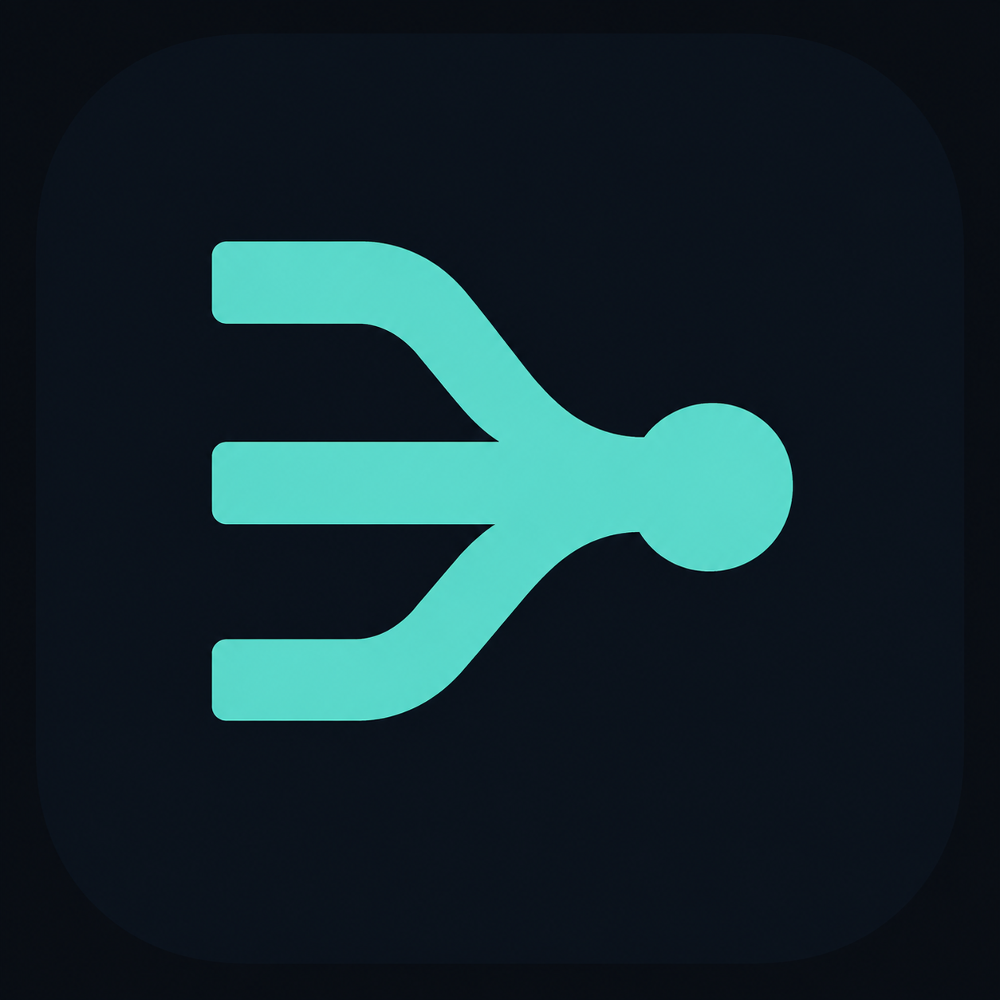
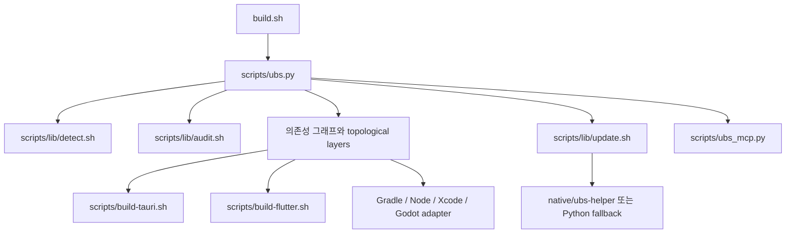
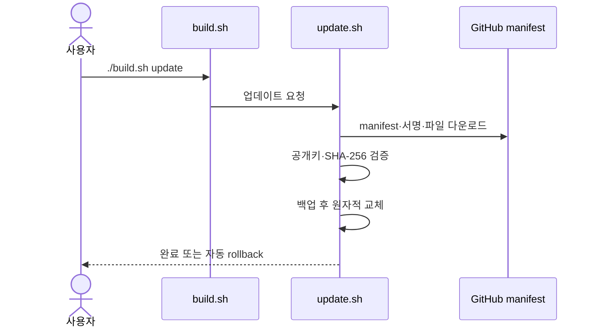

# UBS



**Universal Build Script** — Flutter, Tauri, Android/Kotlin, React/Next.js/Node, iOS/Xcode, Godot 프로젝트를 자동 감지하고 빌드·감사·배포하는 CLI와 데스크톱 앱.

프로젝트 하나 또는 모노레포 루트에서 `./build.sh` 한 번으로 감지 → 의존성 정렬 → 플랫폼별 빌드를 실행한다. AI 에이전트용 MCP 서버와 한국어·영어·일본어·중국어 CLI도 포함한다.

## 핵심 기능

- 설정 파일 없이 11가지 프로젝트 타입 자동 감지
- 모노레포 의존성 그래프와 위상 정렬
- 독립 프로젝트 bounded 병렬 빌드
- 읽기 전용 `detect`, `plan`, `graph`, `audit` 명령과 JSON 출력
- Flutter·Tauri·Android·Xcode·Godot·Node 계열 빌드 어댑터
- App Store Connect와 Google Play 업로드
- 서명된 manifest 검증, 백업, 원자적 self-update
- Tauri 2 기반 선택형 데스크톱 GUI
- dependency-free stdio MCP 서버

## 동작 흐름


## 빠른 시작

### 요구 사항

- Python 3.9 이상
- 각 프로젝트 타입의 네이티브 도구는 해당 빌드에서 별도 필요
- `native/ubs-helper`를 직접 빌드할 때만 Rust toolchain 필요

### 저장소에서 실행

```bash
git clone https://github.com/ubs-Paltform/ubs.git
cd ubs

# 감지 결과 확인
./build.sh detect

# 실행할 명령 미리 보기
./build.sh --dry-run --all

# 안전한 기본값으로 빌드
./build.sh
```

### 설치 후 실행

```bash
curl -fsSL https://raw.githubusercontent.com/ubs-Paltform/ubs/main/install.sh | bash
```

설치기는 관리 대상 파일을 staging하고 checksum·manifest를 검증한 뒤 원자적으로 적용한다. 기존 파일을 교체하려면 `UBS_FORCE=true`를 명시한다.

## CLI

| 명령 | 용도 |
| --- | --- |
| `./build.sh` | 현재 경로 자동 감지 후 빌드 |
| `./build.sh detect [PATH]` | 하위 프로젝트 감지 |
| `./build.sh audit [PATH]` | 최적화·난독화 설정 감사 |
| `./build.sh plan [PATH]` | 읽기 전용 빌드 계획 출력 |
| `./build.sh graph --json [PATH]` | 의존성 그래프·위상 정렬 출력 |
| `./build.sh build --project PATH` | 특정 프로젝트 빌드 |
| `./build.sh build --all --type TYPE` | 특정 타입만 빌드 |
| `./build.sh publish` | 기존 `.ipa`, `.pkg`, `.aab` 업로드 |
| `./build.sh update --check` | 런타임 업데이트 확인 |
| `./build.sh update --dry-run` | 업데이트 변경 내용 미리 보기 |
| `./build.sh update` | 검증 후 런타임 업데이트 |

주요 옵션:

| 옵션 | 값 | 용도 |
| --- | --- | --- |
| `--version-bump` | `none\|build\|patch\|minor\|major` | 버전 변경 정책 |
| `--flutter-platform` | `auto\|all\|ios\|android\|macos` | Flutter 대상 플랫폼 |
| `--flutter-outputs` | `appbundle,apk,ipa,web,pkg` | Flutter 산출물 선택 |
| `--clean` / `--skip-clean` | flag | 사전 clean 강제·비활성화 |
| `--jobs N` | 정수, 최대 4 | 병렬 프로젝트 수 |
| `--fail-fast` | flag | 첫 실패에서 중단 |
| `--verbose` | flag | 어댑터 전체 로그 표시 |
| `--report-json FILE` | 파일 경로 | 실제 빌드 결과 저장 |
| `--publish` / `--no-publish` | flag | 빌드 후 업로드 강제·비활성화 |

JSON 결과가 필요한 CI·에이전트 환경:

```bash
UBS_NON_INTERACTIVE=true \
  ./build.sh --all --version-bump patch --jobs 4 --report-json report.json

./build.sh detect --json
./build.sh audit --json
./build.sh plan --json
./build.sh graph --json
```

자주 쓰는 환경 변수:

| 변수 | 용도 |
| --- | --- |
| `UBS_JOBS` | 독립 프로젝트 병렬 수 재정의 |
| `UBS_LANG` | CLI 언어 지정 |
| `UBS_GRADLE_FLAGS` | Gradle adapter 추가 인자 |
| `UBS_INSTALL_MODE` | 설치·업데이트 모드 지정 |
| `UBS_MANAGE_GITIGNORE` | 설치기의 `.gitignore` 관리 블록 적용 여부 |
| `UBS_MCP_ROOT` | MCP 서버가 접근할 작업 루트 제한 |

## 지원 프로젝트

| 타입 | 감지 기준 | 빌드 어댑터 |
| --- | --- | --- |
| `tauri` | `src-tauri/tauri.conf.json` | `scripts/build-tauri.sh` |
| `flutter` | `pubspec.yaml`의 Flutter 의존성 | `scripts/build-flutter.sh` |
| `android` | Android Gradle plugin | Python Gradle adapter |
| `kotlin-multiplatform` | KMP plugin | Python Gradle adapter |
| `kotlin` | Kotlin Gradle 프로젝트 | Python Gradle adapter |
| `gradle` | 일반 Gradle 프로젝트 | Python Gradle adapter |
| `react` | React 의존성 `package.json` | Node adapter |
| `next` | Next.js 의존성 `package.json` | Node adapter |
| `node` | `build` script가 있는 `package.json` | Node adapter |
| `ios-xcode` | `*.xcodeproj` 또는 `*.xcworkspace` | Xcode adapter |
| `godot` | `project.godot` | Godot adapter |

## 빌드 파이프라인



| 경로 | 역할 |
| --- | --- |
| `build.sh` | 안정적인 CLI 진입점 |
| `scripts/ubs.py` | 감지·계획·그래프·오케스트레이션·리포트 핵심 |
| `scripts/lib/detect.sh` | 파일시스템 기준 프로젝트 타입 감지 |
| `scripts/lib/audit.sh` | 최적화·난독화 정책 감사 |
| `scripts/build-*.sh` | Flutter·Tauri 플랫폼 빌드 |
| `scripts/lib/update.sh` | 서명 검증 기반 self-update |
| `scripts/ubs_mcp.py` | MCP stdio 서버 |
| `native/ubs-helper` | SHA-256·manifest 검증 Rust helper |
| `desktop/` | Tauri 2 데스크톱 UI |

## 모노레포와 병렬 빌드

Node workspace와 `package.json` 의존성은 자동으로 연결한다. 추가 관계는 루트에 `ubs.dependencies.json`을 둔다.

```json
{
  "schema_version": 1,
  "dependencies": {
    "apps/mobile": ["packages/shared"],
    "apps/web": ["packages/shared"]
  }
}
```

순환 의존성은 빌드 전에 거부한다. 기본 병렬 수는 CPU 기준으로 계산하고 최대 4개이며, `--jobs N` 또는 `UBS_JOBS`로 조정할 수 있다. 충돌하는 프로젝트는 자동 직렬화한다.

## 데스크톱 앱

`desktop/`은 같은 `build.sh` 엔진을 사용하는 Tauri 2 GUI다. 프런트엔드는 외부 의존성 없는 HTML·CSS·JavaScript이며, 프로젝트 폴더 선택·감지 프로젝트 저장·버전 변경·병렬 작업 수·Flutter 산출물 선택을 제공한다.

```bash
cd desktop/src-tauri
cargo run
```

네이티브 번들 빌드:

```bash
cargo install tauri-cli --version 2.11.4 --locked
cargo tauri build
```

GUI 빌드는 `--non-interactive --no-publish`로 고정되며, 한 번에 하나만 실행한다. 디자인 토큰은 [DESIGN_SYSTEM.md](DESIGN_SYSTEM.md)에 있다.

## MCP 서버

```bash
python3 scripts/ubs_mcp.py
```

기본 노출 도구:

| 도구 | 용도 |
| --- | --- |
| `ubs_detect` | 프로젝트 감지 |
| `ubs_audit` | 최적화·난독화 감사 |
| `ubs_plan` | 빌드 계획 반환 |
| `ubs_graph` | 의존성 그래프 반환 |
| `ubs_update_check` | 업데이트 확인 |
| `ubs_build` | dry-run 또는 명시적 확인 후 빌드 |

실제 빌드는 서버에 `UBS_MCP_ALLOW_BUILD=true`, 호출에 `confirm=true`가 모두 필요하다. `UBS_MCP_ROOT`로 서버가 볼 수 있는 작업 루트를 제한할 수 있다.

## 배포와 보안

`publish`는 이미 생성된 산출물을 업로드한다.

- App Store Connect: `.ipa`, `.pkg`
- Google Play: `.aab`, `--track internal|alpha|beta|production`

자격 증명 변수 예시는 [.env.example](.env.example)와 [.env.macos.example](.env.macos.example)에 있다. 실제 키·프로비저닝 프로파일은 저장소에 커밋하지 않는다.

업데이트 흐름:



`install.sh`와 `scripts/lib/update.sh`는 ECDSA-P256 공개키로 signed manifest를 확인한다. 업데이트 실패 시 적용된 파일을 백업에서 복구한다.

첫 설치의 provenance를 별도로 확인하려면:

```bash
UBS_INSTALL_REF=v3.11.1
curl -fsSL "https://raw.githubusercontent.com/ubs-Paltform/ubs/$UBS_INSTALL_REF/install.sh" -o install.sh
gh attestation verify install.sh \
  --repo ubs-Paltform/ubs \
  --signer-workflow ubs-Paltform/ubs/.github/workflows/attest-release.yml
UBS_INSTALL_REF="$UBS_INSTALL_REF" bash install.sh
```

## 다국어 CLI

지원 언어: `ko`, `en`, `ja`, `zh`.

```bash
UBS_LANG=ko ./build.sh detect
UBS_LANG=en ./build.sh plan --json
```

언어 선택 우선순위는 `UBS_LANG` → `LC_ALL` → `LC_MESSAGES` → `LANG` → macOS 시스템 언어 → 영어다.

## 개발 및 검증

문법·핵심 동작 검증:

```bash
bash -n build.sh install.sh scripts/*.sh scripts/lib/*.sh tests/*.sh
python3 -m py_compile scripts/ubs.py scripts/ubs_mcp.py scripts/i18n.py scripts/i18n_messages.py
python3 tests/test_python_core.py
python3 tests/test_mcp.py
bash tests/test-detection.sh
bash tests/test-desktop-gui.sh
```

Rust helper 검증:

```bash
cd native/ubs-helper
cargo fmt --all -- --check
cargo test --all-targets
```

## 라이선스

[MIT License](LICENSE)
