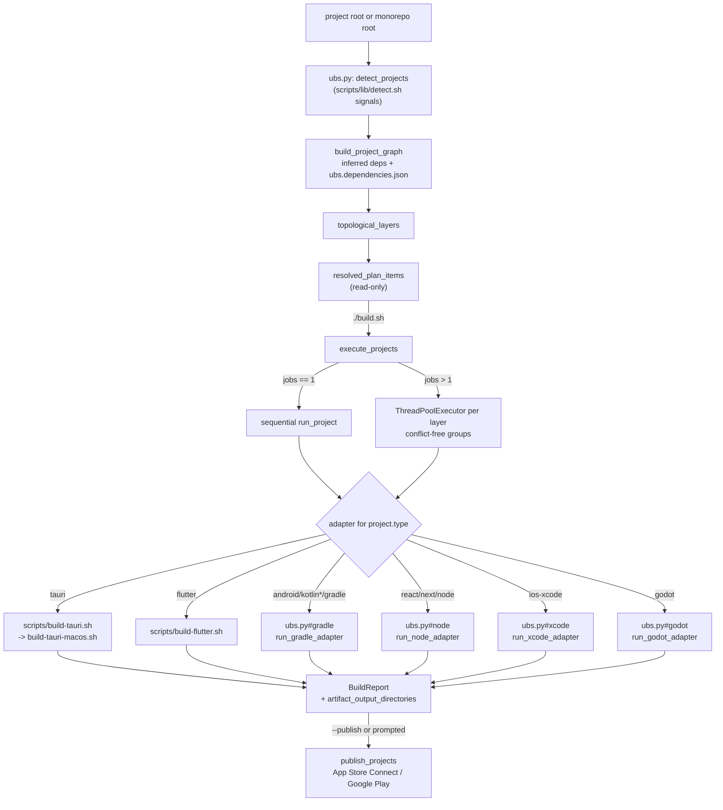
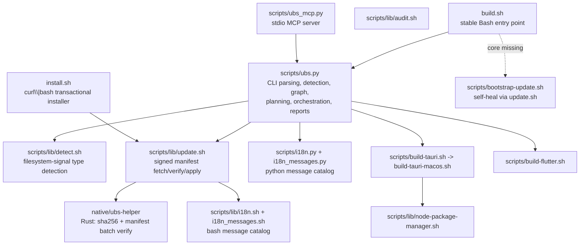
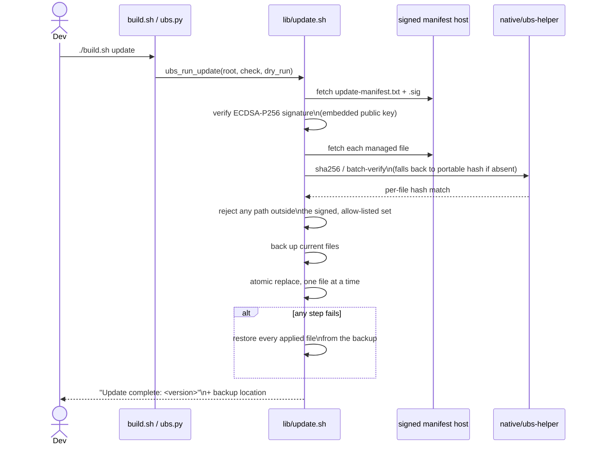

# ubs

**Universal release build orchestrator for Flutter, Tauri, Android/Kotlin, React/Node, iOS/Xcode, and Godot — one command, auto-detected, AI-agent and MCP ready.**

`ubs` (entry point `./build.sh`) is a Bash + Python CLI that detects what kind of project — or monorepo of projects — you're standing in, resolves inter-project build dependencies into a topological order, and runs the right platform-specific build adapter. It ships with safe interactive defaults, a non-interactive/CI mode, bounded automatic parallel builds of independent projects, concise failure-safe logs, an optimization/obfuscation audit, App Store Connect and Google Play publishing, a signed and atomic self-update mechanism, and CLI output localized into `ko`/`en`/`ja`/`zh`. A bundled MCP server exposes the same detect/audit/plan/graph/build surface to AI agents.

This document is grounded entirely in the current `build.sh`, `install.sh`, `scripts/`, and `native/ubs-helper/` of this repository — no invented commands, flags, or architecture.

## Table of contents

- [What it does](#what-it-does)
- [Pipeline overview](#pipeline-overview)
- [Architecture](#architecture)
- [Desktop UI](#desktop-ui)
- [CLI reference](#cli-reference)
- [Detected project types & adapters](#detected-project-types--adapters)
- [Build adapters in depth](#build-adapters-in-depth)
- [Parallel builds & dependency graph](#parallel-builds--dependency-graph)
- [Audit: optimization & obfuscation checks](#audit-optimization--obfuscation-checks)
- [Publishing](#publishing)
- [Self-update: signed and atomic](#self-update-signed-and-atomic)
- [Security: trust roots and verified install](#security-trust-roots-and-verified-install)
- [MCP server](#mcp-server)
- [Localization](#localization)
- [Requirements & install](#requirements--install)
- [License](#license)

## What it does

Given a project directory (or a monorepo root), `ubs`:

1. **Detects** every buildable sub-project by inspecting the filesystem — no config file required — and classifies each into one of eleven supported types.
2. **Resolves dependencies** between detected projects (via inferred Node workspace/package-name links, or an explicit `ubs.dependencies.json`) into topologically ordered layers.
3. **Plans** the exact build command for each project — read-only, so it's safe to inspect before anything runs.
4. **Builds** each project through its adapter, using bounded CPU-based parallelism for independent projects by default, with conflict serialization, concise non-interactive output, full failure logs, and safe interactive version/platform prompts.
5. **Audits** every project's optimization and obfuscation configuration against platform-specific checks, independent of running an actual build.
6. **Publishes** finished artifacts to App Store Connect (`.ipa`/`.pkg`) or Google Play (`.aab`) on request.
7. **Updates** its own managed files in place — signature-verified, staged, and atomically applied with automatic rollback on any failure.

## Pipeline overview



## Architecture



| File | Role |
|---|---|
| `build.sh` | Stable compatibility entry point; execs `scripts/ubs.py`, or delegates to `bootstrap-update.sh` when the Python core is missing |
| `install.sh` | Standalone (`curl \| bash`) transactional installer — stages every managed file, verifies checksums against a signed manifest, then atomically replaces, with full rollback on any failure |
| `scripts/ubs.py` | The orchestration core: argument parsing, project detection dispatch, dependency graph, topological + parallel execution, audit, publish (App Store Connect / Google Play), JSON output for `detect`/`audit`/`plan`/`graph` |
| `scripts/lib/detect.sh` | Pure filesystem signals (`pubspec.yaml`, `src-tauri/tauri.conf.json`, `build.gradle*`, `package.json`, `*.xcodeproj`, …) that classify a directory into one of the eleven supported types |
| `scripts/lib/audit.sh` | Optimization/obfuscation policy checks, called by `ubs.py`'s `audit_project` |
| `scripts/lib/update.sh` | Fetches the signed update manifest, verifies its ECDSA-P256 signature, downloads and hashes each managed file, stages, backs up, and atomically replaces — with `ubs_update_allowed_path` as a second, independent allow-list beyond the manifest's own signature |
| `scripts/bootstrap-update.sh` | Minimal recovery path used only when `scripts/ubs.py` itself is missing |
| `scripts/build-tauri.sh` / `build-tauri-macos.sh` | Tauri adapter: version bump, frontend build, optional JS obfuscation, `tauri build`, Apple codesigning/notarization-ready `.pkg` |
| `scripts/build-flutter.sh` | Flutter adapter: version bump, platform selection (iOS/Android/both/macOS), parallel or sequential native builds, AAB/APK/IPA/PKG/Web outputs |
| `scripts/lib/node-package-manager.sh` | Detects and drives npm/pnpm/yarn from `packageManager` + lockfile |
| `scripts/ubs_mcp.py` | Dependency-free stdio MCP server wrapping the same core |
| `native/ubs-helper` | Optional Rust binary: SHA-256 hashing and batch manifest verification, with a portable Python fallback when it isn't built |
| `scripts/lib/i18n.sh` + `i18n_messages.sh` / `scripts/i18n.py` + `i18n_messages.py` | Independent bash and Python message catalogs behind `UBS_LANG` |

## Desktop UI

`desktop/` is an optional Tauri 2 window over the same `build.sh` engine. It uses the operating-system WebView plus plain HTML/CSS/JavaScript: no React, Vite, Node runtime, local web server, analytics, or remote assets. The interface follows the OS language for Korean, English, Japanese, and Chinese, falling back to English.

```bash
# Develop from source
cd desktop/src-tauri
cargo run

# Build the native application bundle (tauri-cli 2.11.4 required)
cargo install tauri-cli --version 2.11.4 --locked
cargo tauri build
```

The native folder picker can open a project or monorepo root. Detected projects are kept locally in the WebView and restored on the next launch; each saved folder has a direct build button using the visible safe options. Version change, bounded parallel jobs, incremental/clean mode, and Flutter outputs are selectable in the window. Every GUI build forces `--non-interactive --no-publish`; values are allow-listed before they reach the subprocess, only one build runs at a time, and Cancel terminates the build process group. Packaged apps carry the same UBS scripts as read-only resources. Visual tokens and interaction rules live in [`DESIGN_SYSTEM.md`](DESIGN_SYSTEM.md).

## CLI reference

```text
./build.sh                         Auto-detect + unattended build with safe defaults
./build.sh detect [path]           Discover sub-projects
./build.sh detect --json [path]    Detection result as JSON for AI/MCP
./build.sh audit [path]            Audit optimization/obfuscation settings
./build.sh audit --json [path]     Audit result as JSON for AI/MCP
./build.sh plan [path]             Read-only build plan
./build.sh plan --json [path]      Build plan as JSON for AI/MCP
./build.sh graph --json [path]     Project dependency/topological-order JSON
./build.sh update --check [--json] Check for a full runtime update
./build.sh update --dry-run        Preview changed files
./build.sh update                  Safe update with verification and backup
./build.sh update --prune-backups 30  Delete update backups older than 30 days
./build.sh --dry-run               Preview which build would run
./build.sh --interactive           Choose version and platform directly
./build.sh build --project <path>  Build a specific project
./build.sh build --all --type TYPE Build only a given type
./build.sh publish [--project PATH] [--artifact FILE] [--track TRACK]  Upload one existing store artifact
```

| Option | Values | Purpose |
|---|---|---|
| `--version-bump` | `none\|build\|patch\|minor\|major` | Non-interactive version-bump policy |
| `--flutter-platform` | `auto\|all\|ios\|android\|macos` | Non-interactive Flutter platform selection |
| `--flutter-outputs` | `auto\|appbundle,apk,ipa,web,pkg` (comma list) | Explicit Flutter output set |
| `--clean` / `--skip-clean` | flag | Force or skip pre-build cleaning |
| `--obfuscate-js` / `--no-obfuscate-js` | flag | Tauri frontend JS obfuscation (asked once, remembered per-repo on the first Tauri build) |
| `--publish` / `--no-publish` | flag | Force or disable store upload after a successful build |
| `--artifact FILE` | path | Select exactly one discovered upload candidate for `publish` |
| `--fail-fast` | flag | Stop at the first failure instead of continuing independent projects |
| `--jobs N` | integer | Override the CPU-based parallel project limit (automatic default, max 4) |
| `--verbose` | flag | Stream full adapter output instead of concise success output |
| `--report-json <file>` | path | Write the actual (not planned) build result as JSON |
| `--track` | Google Play track | `internal\|alpha\|beta\|production` for `publish` |

### Tauri build number (macOS)

`src-tauri/tauri.conf.json` carries two versions: the top-level `version`
(CFBundleShortVersionString, the number users see) and `bundle.macOS.bundleVersion`
(CFBundleVersion, the build number). App Store Connect rejects an upload whose
CFBundleVersion is not higher than the last one it accepted, even when the marketing
version changed — so the macOS Tauri adapter bumps the last numeric component of
`bundleVersion` on every build that is not cancelled (`0.1.37` → `0.1.38`), independent
of the version choice, and restores it if the build fails.

- Only applies when `bundle.macOS.bundleVersion` already exists; the key is never created.
- `--version-bump build` keeps the marketing version and bumps only the build number.
- Non-interactive `--version-bump none` leaves both untouched, so agent builds do not
  dirty the working tree.
- `UBS_BUNDLE_VERSION_BUMP=none` disables the bump; `=auto` forces it back on.

```bash
# Auto-detect everything under the current directory and build with safe defaults
./build.sh

# See what would run, without building anything
./build.sh --dry-run --all

# CI: non-interactive patch bump, parallel build, machine-readable report
UBS_NON_INTERACTIVE=true ./build.sh --all --version-bump patch --jobs 4 --report-json report.json

# Inspect without side effects
./build.sh detect --json
./build.sh audit --json
./build.sh graph --json
```

## Detected project types & adapters

| Type | Detection signal (`scripts/lib/detect.sh`) | Adapter |
|---|---|---|
| `tauri` | `src-tauri/tauri.conf.json` | `scripts/build-tauri.sh` → `build-tauri-macos.sh` |
| `flutter` | `pubspec.yaml` with a `flutter:` / `sdk: flutter` entry | `scripts/build-flutter.sh` |
| `android` | Gradle project targeting an Android plugin | `ubs.py#gradle` |
| `kotlin-multiplatform` | Gradle project with a KMP plugin | `ubs.py#gradle` |
| `kotlin` | Gradle project, Kotlin, no Android/KMP plugin | `ubs.py#gradle` |
| `gradle` | `build.gradle`/`build.gradle.kts`/`gradlew` without a more specific match | `ubs.py#gradle` |
| `react` | `package.json` with a React dependency | `ubs.py#node` |
| `next` | `package.json` with a Next.js dependency | `ubs.py#node` |
| `node` | `package.json` with a `build` script, no more specific framework | `ubs.py#node` |
| `ios-xcode` | `*.xcodeproj` with no Flutter/Tauri wrapper | `ubs.py#xcode` |
| `godot` | `project.godot` | `ubs.py#godot` |

## Build adapters in depth

### Flutter

`scripts/build-flutter.sh` runs `flutter clean` (unless `UBS_SKIP_CLEAN=true`) and `flutter pub get`, then builds the requested outputs in release mode with `--obfuscate --split-debug-info --tree-shake-icons` (native Web output doesn't support Dart obfuscation). `--dart-define-from-file` is applied automatically from `.env.prod` if present, else `.env`. On success the version bump is committed to `pubspec.yaml`; if the build fails or is cancelled partway through, it's restored via an `EXIT` trap so an uncommitted diff never accumulates.

macOS (`pkg` output, requires a macOS host) runs `flutter build macos` followed by `xcodebuild archive` + `xcodebuild -exportArchive`, since Flutter has no single command equivalent to `flutter build ipa` for the desktop target. It looks for `macos/ExportOptions.plist` in the project first (`UBS_MACOS_EXPORT_OPTIONS` to override the path), falling back to the generic `templates/flutter/ExportOptions.plist`-style template at `templates/flutter/ExportOptions-macos.plist`. Manual signing (`signingStyle=manual`) needs both `signingCertificate` and `installerSigningCertificate` set in that plist — Xcode rejects the `.pkg` export with a "doesn't include signing certificate" error otherwise, even when the `.app` itself signed fine.

```bash
# Interactive: prompts for version bump, platform, and (first run) sequential vs concurrent
./build.sh --type flutter

# CI: non-interactive patch bump, both platforms, explicit output set
UBS_NON_INTERACTIVE=true UBS_VERSION_BUMP=patch UBS_FLUTTER_PLATFORM=all \
  UBS_FLUTTER_OUTPUTS=appbundle,ipa ./build.sh --type flutter

# macOS App Store package only
UBS_NON_INTERACTIVE=true UBS_VERSION_BUMP=none UBS_FLUTTER_PLATFORM=macos ./build.sh --type flutter
```

### Tauri

`scripts/build-tauri.sh` execs into `scripts/build-tauri-macos.sh`, which runs the same build flow on every OS and layers Apple signing/packaging on top only when the host is macOS, reading `.env.macos` (plain `key=value`, never `source`d) for `TAURI_SIGN_IDENTITY`, `TAURI_INSTALLER_IDENTITY`, `TAURI_PROVISION_PROFILE`, and `TAURI_ENTITLEMENTS`. On macOS with `rustup` available it defaults to a universal `aarch64`+`x86_64` binary (`TAURI_UNIVERSAL_MACOS=false` to disable).

```bash
# Unsigned .app, with frontend JS obfuscation on for this build
./build.sh --type tauri --obfuscate-js

# Signed, notarization-ready .pkg (macOS, .env.macos must already be configured)
UBS_TAURI_PACKAGE_MODE=signed ./build.sh --type tauri
```

### Android, Kotlin & Gradle

The detected subtype (`android`, `kotlin-multiplatform`, `kotlin`, or generic `gradle`) picks the default task — `bundleRelease` on the app module for Android, `build` otherwise.

```bash
# A non-default product flavor, plus Gradle's own build cache and parallelism
UBS_GRADLE_TASK=:app:bundleProdRelease UBS_GRADLE_OPTIMIZE=true ./build.sh --type android
```

### Xcode-only iOS

For a directory with an `*.xcworkspace`/`*.xcodeproj` and no Tauri/Flutter wrapper, `ubs.py#xcode` archives a shared scheme in Release configuration.

```bash
UBS_XCODE_SCHEME=MyApp UBS_XCODE_EXPORT=true \
  UBS_XCODE_EXPORT_OPTIONS=ExportOptions.plist ./build.sh --type ios-xcode
```

### Godot

`ubs.py#godot` parses every `[preset.N]` block in `export_presets.cfg` (name, `platform`, `export_path`, `encrypt_pck`, `script_export_mode`) and runs `godot --headless --path <dir> --export-release "<preset name>" <export_path>` once per selected preset — always `--export-release`, never a debug export template. `UBS_GODOT_PLATFORM` selects which presets run: `auto` (default, every preset in the file), `ios`, or `android`; `UBS_GODOT_PRESET=<name>` overrides platform filtering and picks exactly one preset by name. An iOS preset is skipped with a warning under `auto` on a non-macOS host, or fails outright if iOS was requested explicitly (`godot`'s own iOS export shells out to `xcodebuild`, so it needs the same macOS host `ios-xcode` does). `UBS_GODOT_BIN` overrides the `godot` executable (default: whatever `godot` resolves to on `PATH`), and `UBS_GODOT_FLAGS` appends extra arguments to the export command.

```bash
# Every preset in export_presets.cfg
./build.sh --type godot

# Just the Android preset(s), with a non-default Godot binary
UBS_GODOT_PLATFORM=android UBS_GODOT_BIN=/Applications/Godot.app/Contents/MacOS/Godot \
  ./build.sh --type godot

# One named preset by hand
UBS_GODOT_PRESET="iOS" ./build.sh --type godot
```

The audit (`./build.sh audit`) reads the same parsed presets without building: `release-export` is always `enforced` (the adapter never uses a debug export), and each preset gets its own `script-export-mode:<name>` (`Text`/`Compiled`/`Encrypted` — GDScript's own obfuscation knob) and `encrypt-pck:<name>` (whether the exported PCK is encrypted) checks.

### React, Next.js & Node

The `react`/`next`/`node` subtype is cosmetic — all three run the same `package.json` script (default `build`) through the detected package manager (`packageManager` field, then lock files: pnpm, Yarn, Bun, npm).

```bash
UBS_NODE_BUILD_SCRIPT=build:production ./build.sh --type node
```

## Parallel builds & dependency graph

`ubs.py` infers dependencies from Node workspace membership and matching `package.json` `name`/dependency fields, then layers them with a standard topological sort. An explicit `ubs.dependencies.json` (`{"schema_version": 1, "dependencies": {"appA": ["libB"]}}`) can declare additional edges; every referenced path must resolve to a project that was actually selected, and cycles are rejected before any build starts. `./build.sh graph --json` prints the resolved layers and edges without building anything. Unless `--jobs N` or `UBS_JOBS` overrides it, UBS uses half the detected logical CPUs rounded up, capped at 4. Conflicting workspace projects remain serial. Non-interactive successful builds show one localized completion line plus important notices and warnings; failures replay the last 2 MiB of adapter output. `--verbose` restores live full output.

## Audit: optimization & obfuscation checks

`./build.sh audit` runs `audit_project` against every detected project without building it, reporting a category (`optimization`/`obfuscation`), a check name, a status (`configured`/`not-configured`/`enforced`/`project-specific`/…), and a human-readable detail — for example, Flutter's `--obfuscate`/`--split-debug-info` enforcement, Tauri's Cargo `lto`/`strip` profile and optional `javascript-obfuscator` pass, Android's R8/ProGuard and resource-shrinking flags, and Xcode's Release optimization level and installed-product symbol strip. `--json` emits the same data as structured records for CI gating or an AI agent.

## Publishing

`./build.sh publish` uploads an already-built artifact: `.ipa`/`.pkg` via `xcrun altool` to App Store Connect (needs `ASC_API_KEY_ID`, `ASC_API_ISSUER_ID`, `ASC_APPLE_ID`, `ASC_BUNDLE_ID`, plus a resolvable app version), or `.aab` to Google Play (needs `GOOGLE_PLAY_SERVICE_ACCOUNT_JSON`, `GOOGLE_PLAY_PACKAGE_NAME`, uploaded in resumable chunks via a hand-rolled service-account JWT — no Google client library dependency) at `--track internal|alpha|beta|production`. A successful `./build.sh` can also prompt to publish immediately, or do so automatically with `--publish`.

## Self-update: signed and atomic



The manifest itself is generated (`scripts/generate-update-manifest.sh`) and signed (`scripts/sign-update-manifest.sh`) with a private key that never enters this repository — only the matching public key is embedded, identically, in both `install.sh` and `scripts/lib/update.sh` (CI checks the two copies match). A downgrade is refused unless `UBS_UPDATE_ALLOW_DOWNGRADE=true` is set explicitly.

## Security: trust roots and verified install

**The first install and later updates don't share a trust root.** A first-time `curl | bash` install pulls `install.sh`, the public key, the manifest, and every payload file from the same GitHub channel — so that channel is the entire trust root, and if the repository/account were ever compromised, the signature-verification code and key could be replaced together. Once installed, though, `./build.sh update` checks new manifests against the public key already on local disk (fixed at install time), so a later repository compromise can't forge a manifest that passes — the signature only protects the supply chain *after* installation.

To close that first-install gap, verify [GitHub Artifact Attestation](https://docs.github.com/en/actions/security-for-github-actions/using-artifact-attestations/using-artifact-attestations-to-establish-provenance-for-builds) — Sigstore-based, signed via GitHub Actions OIDC, recorded in the public Rekor transparency log — before running the installer:

```bash
curl -fsSL https://raw.githubusercontent.com/Claude-Personal/ubs/main/install.sh -o install.sh
gh attestation verify install.sh \
  --repo Claude-Personal/ubs \
  --signer-workflow Claude-Personal/ubs/.github/workflows/attest-release.yml
bash install.sh
```

This confirms that `install.sh` was attested by this repository's release workflow. The workflow refuses to attest an unprotected tag, so repository administrators must configure a ruleset that protects `v*` tags before releasing. Artifact attestation verifies provenance; it does not make a compromised repository or approved release workflow trustworthy. As a lighter-weight, out-of-band fallback, the manifest signing public key's fingerprint is pinned below; `install.sh` also prints this value at run time, so compare it before trusting a fresh install:

```text
MANIFEST_PUBLIC_KEY fingerprint (SHA-256):
5600ca18df518517fa44ff96673ef7fbdbe7d27b8168228d32d75fc7fbae4064
```

## MCP server

`scripts/ubs_mcp.py` is a dependency-free stdio MCP server over the same core. Read-only tools are exposed by default; a real build additionally requires `UBS_MCP_ALLOW_BUILD=true` on the server and `confirm=true` on the call.

| Tool | Purpose |
|---|---|
| `ubs_detect` | Detect projects without changing anything |
| `ubs_audit` | Run the optimization/obfuscation audit |
| `ubs_plan` | Return the resolved, read-only build plan |
| `ubs_graph` | Return the dependency graph and topological layers |
| `ubs_update_check` | Check for a runtime update without modifying files |
| `ubs_build` | Run a dry-run, or an explicitly confirmed real build |

`UBS_MCP_ROOT` bounds the workspace the server can see; it defaults to the server's own working directory.

## Localization

CLI output (errors, progress, interactive menus, `--help`) resolves through `UBS_LANG`, falling back to `LC_ALL` → `LC_MESSAGES` → `LANG`, then — on macOS only — the system language (`defaults read -g AppleLocale`), then `en`. Supported: `ko`, `en`, `ja`, `zh`; anything else at a given step (including `C`/`POSIX`) falls through to the next one.

The macOS step matters because a process started outside a login shell — an IDE, a coding agent, `launchd`, `cron` — inherits `LANG=C.UTF-8` or nothing at all, which used to read as "this user wants English" even on a Korean Mac. It is only consulted when the environment names no supported language, so it costs nothing in a normal terminal.

```bash
UBS_LANG=ja ./build.sh detect   # env always wins; UBS_LANG=en forces English
```

## Requirements & install

- Python 3.9+ (required); a Rust toolchain is optional, only for building `native/ubs-helper` locally.

```bash
curl -fsSL https://raw.githubusercontent.com/Claude-Personal/ubs/main/install.sh | bash
```

The installer defaults to the current release's immutable Git ref, stages and checksum-verifies every managed file, then applies them as one transaction — see [Self-update: signed and atomic](#self-update-signed-and-atomic) for what backs that.

```bash
# Pin installer and payloads to the same existing tag
UBS_INSTALL_REF=v3.11.0
curl -fsSL "https://raw.githubusercontent.com/Claude-Personal/ubs/$UBS_INSTALL_REF/install.sh" -o install.sh
UBS_INSTALL_REF="$UBS_INSTALL_REF" bash install.sh

# Re-run to update an existing install, replacing local edits to managed files
UBS_FORCE=true bash install.sh

# Skip the installer's idempotent .gitignore block (.ubs/, .env*, signing/, key.properties, …)
UBS_MANAGE_GITIGNORE=false bash install.sh
```

`UBS_INSTALL_REF`, `UBS_JOBS`, `UBS_INSTALL_MODE`, `UBS_MANAGE_GITIGNORE`, `UBS_GRADLE_FLAGS`, and `UBS_GRADLE_OPTIMIZE` are all configurable at install time; the first three also apply to `./build.sh update` afterward.

## License

See [`LICENSE`](LICENSE).
